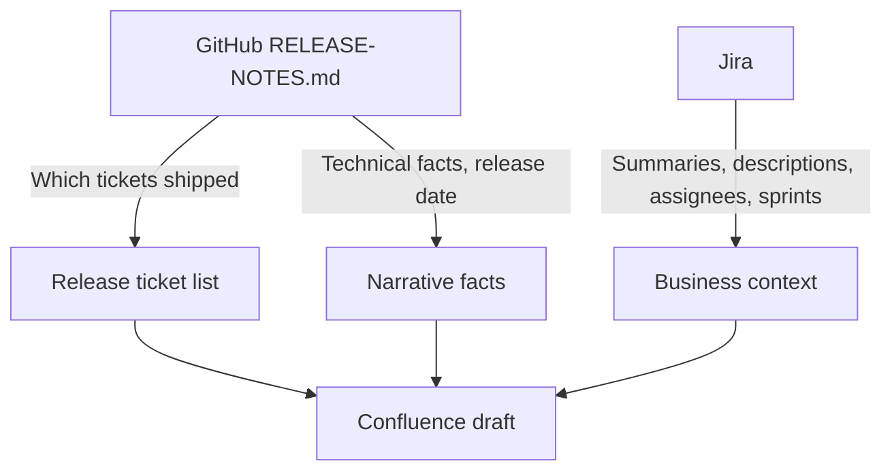

# Confluence Release Notes & Slack Post

Produces two artifacts per release:

| # | Artifact | Destination |
|---|---|---|
| 1 | Confluence page (metadata + description + Programs warning + issue table) | Draft in SD space |
| 2 | Slack post (org-wide summary + Confluence link) | Written in chat only — user posts manually |

**Out of scope:** Info-site publishing decisions (Programs Team). Do not recommend what Programs should publish externally beyond filling the issue table's external column with suggested values.

---

## Source-of-truth hierarchy



| Source | Role |
|---|---|
| **GitHub** `doc/release/RELEASE-NOTES.md` | **Source of truth for release membership.** Only tickets listed under the target `## Release X.Y.Z` section belong in the narrative and issue table. Also provides release date and technical facts. |
| **Jira** | **Supplementary context only.** Fetch summaries, descriptions, assignees, and sprint assignments for GitHub-listed tickets. Use to write business-friendly narrative — never to add tickets GitHub does not list. |
| **Embedded template in this skill** | Page structure and style. Do **not** read prior Confluence pages for format. |

### Facts-only rule

Never invent information. If uncertain about grouping, sprint, or ticket membership, ask the user — do not guess.

### Jira / GitHub mismatches

When Jira Fix Version contains tickets **not** listed in the GitHub release section:

- **Do not** include them in the narrative or issue table.
- **Do** mention the discrepancy to the user after creating the draft (e.g. "Jira Fix Version 2.24.0 also lists OSDEV-2654 and OSDEV-2360, but they appear under Release 2.23.0 in GitHub — omitted from this page.").

Tickets tagged `[Follow-up]` in GitHub **do** count as release tickets if they appear under the target release section.

---

## Workflow

1. **Confirm release version** (if not provided by the user).
2. **Read GitHub** — open `doc/release/RELEASE-NOTES.md` and extract the full `## Release X.Y.Z` section:
   - Release date from Introduction
   - Every ticket ID (`OSDEV-XXXX`) listed in any subsection (Bugfix, What's new, Code/API changes, Architecture/Environment changes, Database changes, etc.)
   - Deduplicate ticket IDs (a ticket may appear in multiple subsections, e.g. OSDEV-2542)
3. **Fetch Jira context** for GitHub-listed tickets only:
   - `key in (OSDEV-XXXX, ...)` — summaries, descriptions, assignees, sprint (`customfield_10020`)
   - Optionally fetch the Jira Fix Version URL for the metadata table Release link
4. **Infer Sprint** from Jira sprint assignments on GitHub-listed tickets:
   - Count tickets per sprint; use the sprint with the most tickets as the primary value
   - Always include a clarifying note in the Sprint table cell (see template below)
   - If all tickets share one sprint, note that; if tied or spanning sprints, explain the split
5. **Build Contributors list** from unique Jira assignees on GitHub-listed tickets (exclude unassigned).
6. **Group into themed narrative** using the embedded template pattern.
7. **Create Confluence draft** (see Confluence settings below).
8. **Write Slack post draft** in chat (see Slack template below).
9. **Ask user to review** the draft and Slack post.

Do **not** attempt to reorder/move the page within the Confluence folder — the Atlassian MCP has no move API.

---

## Confluence settings

| Setting | Value |
|---|---|
| Space | SD (`15859716`) |
| Parent folder | Release Notes (`649494530`) |
| Title format | `{version} - {Mon DD YYYY} - Release Notes` (date from GitHub Introduction) |
| Status | **Draft** (always — user reviews before publishing) |

---

## Confluence page template

Page content follows this **fixed order** (top to bottom):

```
1. Metadata table (includes Description narrative as the last row)
2. Programs Team warning panel
3. Issue tracking table
```

### 1. Metadata table

Single table at the top of the page. The **Description narrative lives inside this table** as the last row — do not place it as standalone content below the table.

| Field | Source |
|---|---|
| **Release** | Jira Fix Version link (e.g. `https://opensupplyhub.atlassian.net/projects/OSDEV/versions/{id}`) |
| **Release Date** | GitHub Introduction |
| **Version** | Release version string |
| **Sprint** | Inferred from Jira (see Sprint field format below) |
| **Contributors** | `@Name` for each unique Jira assignee on GitHub-listed tickets |
| **Description** | Opening summary paragraph + themed narrative (see below) |

**Sprint field format** — always populate with a value, never leave blank:

```
Sprint {N}

Inferred from Jira sprint assignments on GitHub release tickets: {X} of {Y} in Sprint {N}, {Z} in Sprint {M} (OSDEV-XXXX, ...). {Any boundary note — e.g. release date falls at Sprint N/M boundary}. Confirm if a different sprint label is preferred.
```

Italicize the clarification note paragraph.

**Description row content:**

1. **Opening summary** — 1–2 sentences, business-oriented overview of the release.
2. **Themed sections** — group related tickets:

```
💥 **Theme Name** — One-line theme description.

🔹 **Lead-in headline** — Business-friendly explanation of the change. _(OSDEV-XXXX)_

🔹 **Another item** — ... _(OSDEV-YYYY)_
```

**Writing rules:**

- Translate GitHub technical bullets into business language; use Jira user stories/descriptions for context.
- Every `🔹` bullet must reference a ticket listed in GitHub for this release.
- Do not create bullets for tickets that are only in Jira Fix Version.
- Infrastructure items may appear in narrative but are typically `don't include` externally.

### 2. Programs Team callout

Place a **warning panel** directly **below the metadata table** and **above the issue table** so Programs Team sees it before reviewing tickets. Use Confluence HTML:

```html
<div data-type="panel-warning"><p><strong>Programs Team:</strong> Please review tickets marked <strong>include</strong> under <strong>For External Use (Info Site)</strong> and confirm which items should appear on the info-site. These are suggested starting points only.</p></div>
```

Use this exact wording. Do not use a plain paragraph or info panel.

### 3. Issue tracking table

Heading: **Issue**

| Issue | For Internal Use (Team Discussions + Slack Post) | For External Use (Info Site) |
|---|---|---|
| OSDEV-XXXX | `HIGHLIGHT` | `include` or `don't include` |

**One row per GitHub-listed ticket** (deduplicated). Do not add rows for Jira-only tickets.

**Internal column:** Always `HIGHLIGHT` for every ticket.

**External column (suggested values only — Programs Team decides final info-site content):**

| Ticket type | Suggested value |
|---|---|
| User/partner-facing feature, visible UI change | `include` |
| User-visible bug fix | `include` |
| Customer-facing API or download behavior change | `include` |
| Internal moderation tools, admin-only workflows | `don't include` |
| Infrastructure, security patching, analytics | `don't include` |
| Release meta ticket (e.g. OSDEV-2690) | `don't include` |

---

## Slack post template

Write in chat only. Do not send to Slack.

**Audience:** Org-wide. Include all updates from the narrative (no HIGHLIGHT filter).

**Structure:**

```
🚀 **Release {version} is live!** ({date})

{1–2 sentence summary}

{emoji} **{Theme}**
• **{Headline}** — {business description}. *(OSDEV-XXXX)*

{repeat for each theme}

Thanks all for your contributions! 🙌

📋 Full release notes (internal): {Confluence draft URL}

cc @Francesca Romano
```

Keep length proportional to release size — shorter for hotfixes, longer for major releases.

---

## Hotfix handling

Create a **separate Confluence page per deploy** (e.g. 2.22.1 and 2.22.2 each get their own page). Read only the matching GitHub release section for ticket membership.

---

## Worked example: Release 2.24.0

**GitHub tickets** (from `## Release 2.24.0`): OSDEV-2542, 2664, 1521, 2416, 2334, 1940, 2724, 2528, 814 (Follow-up), 2694, 2695

**Omitted from page** (Jira Fix Version 2.24.0 but not in GitHub 2.24.0): OSDEV-2360, 2654, 2690

**Themes used:**

1. Spotlight Search & Platform Navigation — 2542, 2695, 2694
2. Account Registration & Activation — 1521, 2528
3. Platform Improvements & Bug Fixes — 1940, 2416, 2334, 2724
4. Platform Security & Infrastructure — 2664, 2542 (CloudFront caching bullet)

Note: OSDEV-814 is a `[Follow-up]` item in GitHub Bugfix — include in narrative/issue table if present in the GitHub section. If the user confirms it was not in the Jira Fix Version, still include it because GitHub is the source of truth.

**Sprint inference:** 8 of 11 GitHub tickets in Sprint 82, 2 in Sprint 83, 1 follow-up in Sprint 75 → primary Sprint 82 with boundary note.

---

## Related skills

- **GitHub engineering release notes:** `.agent/skills/release-notes/SKILL.md` — separate workflow for updating `doc/release/RELEASE-NOTES.md`.
