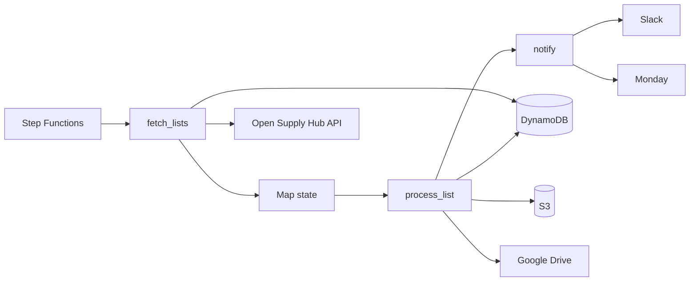

# ContriBot Lambda Functions

Lambda functions that validate facility list uploads and notify data moderators when reports are ready for review.

## Overview

ContriBot polls Open Supply Hub for newly processed facility lists, generates ContriCleaner reports, uploads them to Google Drive, and notifies moderators via Slack and Monday.

## Architecture

The solution leverages **AWS Step Functions** to orchestrate the workflow. Each step is implemented as a Lambda task; processing individual lists runs in a **Map** state over the newly fetched lists.

**DynamoDB** stores the state of processed lists so scheduled runs can skip lists that were already handled and resume safely after failures.

### State Management

Each processed facility list is recorded in DynamoDB (keyed by list ID). The `fetch_lists` task reads this table to determine which lists still need processing; `process_list` updates it after a list is handled successfully.

## Process

| Step | Description                                                                                                          |
| ---- | -------------------------------------------------------------------------------------------------------------------- |
| 1    | Fetch newly processed lists and queue them for processing. Lists are retrieved via `GET /api/admin-facility-lists/`. |
| 2    | For each list, download the file from S3, run the ContriCleaner report, and upload the report to Google Drive.       |
| 3    | Send notifications to Slack and Monday so that data moderators can review the report.                                |

## Configuration

### Secrets Manager

Store sensitive values in AWS Secrets Manager and inject them at runtime.

| Variable                   | Description                                                                |
| -------------------------- | -------------------------------------------------------------------------- |
| `OS_HUB_API_TOKEN`         | API token used to authenticate requests to Open Supply Hub.                |
| `MONDAY_API_KEY`           | API token used to post items to the Monday board.                          |
| `SLACK_API_URL`            | Webhook URL used to send Slack notifications.                              |
| `GOOGLE_DRIVE_SERVICE_KEY` | Google service account credentials used to upload reports to Google Drive. |

### Environment Variables

Nonsensitive configuration can be set as plain Lambda environment variables.

| Variable                           | Description                                                       |
| ---------------------------------- | ----------------------------------------------------------------- |
| `OS_HUB_API_URL`                   | Base URL of the Open Supply Hub API.                              |
| `MONDAY_API_URL`                   | Base URL of the Monday.com API.                                   |
| `AWS_STORAGE_BUCKET_NAME`          | S3 bucket where uploaded facility list files are stored.          |
| `GOOGLE_DRIVE_SHARED_DIRECTORY_ID` | Google Drive folder ID where ContriCleaner reports are uploaded.  |
| `MONDAY_BOARD_ID`                  | ID of the Monday board to post the update.                        |
| `CONTRIBOT_STATE_TABLE_NAME`       | DynamoDB table that stores the state of processed facility lists. |
