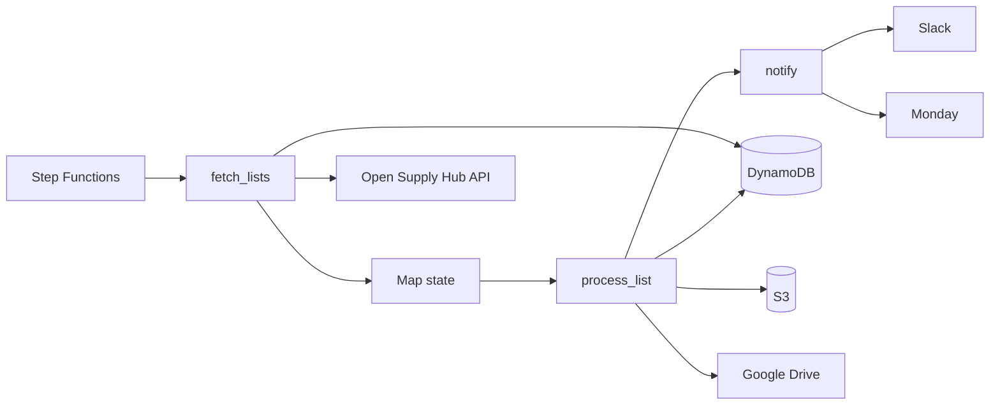

# ContriBot Lambda Functions

Lambda functions that validate facility list uploads and notify data moderators when reports are ready for review.

## Overview

ContriBot polls Open Supply Hub for newly processed facility lists, validates facility list uploads, uploads the annotated reports to Google Drive, and notifies moderators via Slack and Monday.

## Facility List Validation

Facility list validation is implemented in [`lib/contribot.py`](lib/contribot.py). The `ContriBot` class reads a contributor Excel workbook, runs table- and column-level quality checks (missing columns, bad countries, whitespace issues, duplicate rows, and more), applies optional auto-fixes, and writes an annotated output workbook with **Summary**, **Findings**, **Similarities**, and **Fixes** sheets. Findings are driven by error codes in a configuration workbook (`0000.error_codes.xlsx`).

Run the unit tests locally:

```bash
cd src/contribot/lib && python -m pytest tests/test_contribot.py tests/test_lists_repository.py tests/test_os_hub_api.py
cd src/contribot/fetch_lists && python -m pytest tests/test_handler.py
```

## Lambda Source Code

Handler code lives under `src/contribot/`. Each Lambda is a `handler.py` module packaged into a zip for deployment. Shared helpers used by Lambdas live under [`lib/`](lib/) (for example [`lists_repository.py`](lib/lists_repository.py) and [`os_hub_api.py`](lib/os_hub_api.py) for `fetch_lists`).

| Lambda         | Handler source                                       | Deployment package                                                                                                                     |
| -------------- | ---------------------------------------------------- | -------------------------------------------------------------------------------------------------------------------------------------- |
| `fetch_lists`  | [`fetch_lists/handler.py`](fetch_lists/handler.py)   | [`deployment/terraform/lambda-functions/contribot_fetch_lists/`](../../deployment/terraform/lambda-functions/contribot_fetch_lists/)   |
| `process_list` | [`process_list/handler.py`](process_list/handler.py) | [`deployment/terraform/lambda-functions/contribot_process_list/`](../../deployment/terraform/lambda-functions/contribot_process_list/) |
| `notify`       | [`notify/handler.py`](notify/handler.py)             | [`deployment/terraform/lambda-functions/contribot_notify/`](../../deployment/terraform/lambda-functions/contribot_notify/)             |

Shared Python dependencies are listed in [`requirements.txt`](requirements.txt) (runtime) and [`requirements-dev.txt`](requirements-dev.txt) (local development).

Build all deployment zips from this directory:

```bash
make -C src/contribot
```

Each package Makefile builds `deployment/terraform/lambda-functions/<name>/<name>.zip` (for `fetch_lists`, the zip includes `handler.py` plus shared `lib/` modules). Terraform defines the Lambda resources in [`deployment/terraform/contribot_lambda.tf`](../../deployment/terraform/contribot_lambda.tf); the Step Functions workflow is in [`deployment/terraform/step-functions/contribot.json`](../../deployment/terraform/step-functions/contribot.json) and [`deployment/terraform/contribot_sfn.tf`](../../deployment/terraform/contribot_sfn.tf).

## Architecture

The solution leverages **AWS Step Functions** to orchestrate the workflow. Each step is implemented as a Lambda task; processing individual lists runs in a **Map** state over the newly fetched lists.

**DynamoDB** stores the state of processed lists so scheduled runs can skip lists that were already handled and resume safely after failures.



### State Management

DynamoDB stores one item per facility list (hash key `list_id`) with `contributor_id`, `list_name`, `status`, `started_at`, and `finished_at`.

On each run, `fetch_lists`:

1. Reads a dedicated `__CURSOR__` DynamoDB item (`last_list_id`) for the resume watermark (`0` when missing).
2. Queries `GET /api/admin-facility-lists/?id__gt={last_id}&ordering=id`.
3. Writes each returned list as a `PENDING` row **before** returning Map items to Step Functions.
4. Conditionally advances `__CURSOR__.last_list_id` to the highest fetched id.

`process_list` later updates `status` / `finished_at` after a list is handled.

## Process

| Step | Description                                                                                                    |
| ---- | -------------------------------------------------------------------------------------------------------------- |
| 1    | Fetch new lists after the DynamoDB cursor and enqueue them. Lists come from `GET /api/admin-facility-lists/`.  |
| 2    | For each list, download the file from S3, run facility list validation, and upload the report to Google Drive. |
| 3    | Send notifications to Slack and Monday so that data moderators can review the report.                          |

## Configuration

### Secrets Manager

Store sensitive values in AWS Secrets Manager. Lambdas receive each secret's ARN as an environment variable and load the value at runtime via `GetSecretValue`.

| Secret (Secrets Manager) | Environment variable                  | Description                                                                |
| ------------------------ | ------------------------------------- | -------------------------------------------------------------------------- |
| OS Hub API token         | `OS_HUB_API_TOKEN_SECRET_ARN`         | API token used to authenticate requests to Open Supply Hub.                |
| Monday API key           | `MONDAY_API_KEY_SECRET_ARN`           | API token used to post items to the Monday board.                          |
| Slack webhook URL        | `SLACK_API_URL_SECRET_ARN`            | Webhook URL used to send Slack notifications.                              |
| Google Drive service key | `GOOGLE_DRIVE_SERVICE_KEY_SECRET_ARN` | Google service account credentials used to upload reports to Google Drive. |

### Environment Variables

Nonsensitive configuration can be set as plain Lambda environment variables.

| Variable                           | Description                                                       |
| ---------------------------------- | ----------------------------------------------------------------- |
| `OS_HUB_API_URL`                   | Base URL of the Open Supply Hub API.                              |
| `MONDAY_API_URL`                   | Base URL of the Monday.com API.                                   |
| `AWS_STORAGE_BUCKET_NAME`          | S3 bucket where uploaded facility list files are stored.          |
| `GOOGLE_DRIVE_SHARED_DIRECTORY_ID` | Google Drive folder ID where validation reports are uploaded.     |
| `MONDAY_BOARD_ID`                  | ID of the Monday board to post the update.                        |
| `CONTRIBOT_STATE_TABLE_NAME`       | DynamoDB table that stores the state of processed facility lists. |
