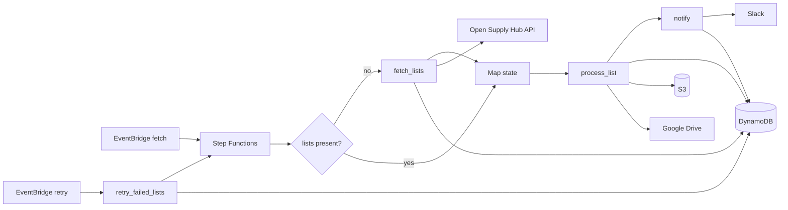

# ContriBot Lambda Functions

Lambda functions that validate facility list uploads and notify data moderators when reports are ready for review.

## Overview

ContriBot polls Open Supply Hub for newly processed facility lists, validates facility list uploads, uploads the annotated reports to Google Drive, and notifies moderators via Slack.

## Facility List Validation

Facility list validation is implemented in [`lib/contribot.py`](lib/contribot.py). The `ContriBot` class reads a contributor Excel workbook, runs table- and column-level quality checks (missing columns, bad countries, whitespace issues, duplicate rows, and more), applies optional auto-fixes, and writes an annotated output workbook with **Summary**, **Findings**, **Similarities**, and **Fixes** sheets. Findings are driven by error codes in the bundled configuration workbook ([`lib/0000.error_codes.xlsx`](lib/0000.error_codes.xlsx)).

Run the unit tests locally:

```bash
for testdir in src/contribot/*/tests; do
  (cd "$(dirname "$testdir")" && python -m pytest tests/)
done
```

## Lambda Source Code

Handler code lives under `src/contribot/`. Each Lambda is a `handler.py` module packaged into a zip for deployment. Shared helpers used by Lambdas live under [`lib/`](lib/) (for example [`lists_repository.py`](lib/lists_repository.py), [`os_hub_api.py`](lib/os_hub_api.py), [`s3_storage.py`](lib/s3_storage.py), [`google_drive.py`](lib/google_drive.py), and [`contribot_workbook.py`](lib/contribot_workbook.py)).

| Lambda                | Handler source                                                       | Deployment package                                                                                                                                                 |
| --------------------- | -------------------------------------------------------------------- | ------------------------------------------------------------------------------------------------------------------------------------------------------------------ |
| `fetch_lists`         | [`fetch_lists/handler.py`](fetch_lists/handler.py)                   | [`deployment/terraform/lambda-functions/contribot_fetch_lists/`](../../deployment/terraform/lambda-functions/contribot_fetch_lists/)                               |
| `process_list`        | [`process_list/handler.py`](process_list/handler.py)                 | [`deployment/terraform/lambda-functions/contribot_process_list/`](../../deployment/terraform/lambda-functions/contribot_process_list/)                             |
| `notify`              | [`notify/handler.py`](notify/handler.py)                             | [`deployment/terraform/lambda-functions/contribot_notify/`](../../deployment/terraform/lambda-functions/contribot_notify/)                                         |
| `retry_failed_lists`  | [`retry_failed_lists/handler.py`](retry_failed_lists/handler.py)     | [`deployment/terraform/lambda-functions/contribot_retry_failed_lists/`](../../deployment/terraform/lambda-functions/contribot_retry_failed_lists/)                 |

Shared Python dependencies are listed in [`requirements.txt`](requirements.txt) (runtime ranges). CI and local pytest use [`requirements-dev.txt`](requirements-dev.txt), a hashed pin of [`requirements-dev.in`](requirements-dev.in). Refresh with `pip-compile --generate-hashes --output-file src/contribot/requirements-dev.txt src/contribot/requirements-dev.in` (Python 3.10).

Build all deployment zips from this directory:

```bash
make -C src/contribot
```

Each package Makefile builds `deployment/terraform/lambda-functions/<name>/<name>.zip`. `fetch_lists` and `retry_failed_lists` zip `handler.py` plus shared `lib/` modules; `process_list` additionally installs `requirements.txt` into the zip and bundles `lib/contribot.py`, helpers, and `0000.error_codes.xlsx`. Terraform defines the Lambda resources in [`deployment/terraform/contribot_lambda.tf`](../../deployment/terraform/contribot_lambda.tf); the Step Functions workflow is in [`deployment/terraform/step-functions/contribot.json`](../../deployment/terraform/step-functions/contribot.json) and [`deployment/terraform/contribot_sfn.tf`](../../deployment/terraform/contribot_sfn.tf).

## Architecture

The solution leverages **AWS Step Functions** to orchestrate the workflow. Each step is implemented as a Lambda task; processing individual lists runs in a **Map** state over the list ids.

Two EventBridge schedules share the same cadence: one starts the state machine with empty input (fetch new lists, then Map), and `retry_failed_lists` scans DynamoDB for `FAILED` rows and starts a second execution whose input already contains `lists`, so the Choice state skips `fetch_lists`.

**DynamoDB** stores the state of processed lists so scheduled runs can skip lists that were already handled and resume safely after failures.


```mermaid
flowchart LR
  ScheduleFetch[EventBridge fetch] --> SFN[Step Functions]
  ScheduleRetry[EventBridge retry] --> Retry[retry_failed_lists]
  Retry --> SFN
  SFN --> Choice{lists present?}
  Choice -->|no| Fetch[fetch_lists]
  Choice -->|yes| Map[Map state]
  Fetch --> Map
  Map --> Process[process_list]
  Process --> Notify[notify]
  Fetch --> API[Open Supply Hub API]
  Fetch --> DDB[(DynamoDB)]
  Retry --> DDB
  Process --> DDB
  Process --> S3[(S3)]
  Process --> GDrive[Google Drive]
  Notify --> Slack[Slack]
  Notify --> DDB
```

### State Management

DynamoDB stores one item per facility list (hash key `list_id`) with `contributor_id`, `list_name`, `file_name`, `status`, `started_at`, `finished_at`, and `attempt_count`.

On each fetch run, `fetch_lists`:

1. Reads a dedicated `__CURSOR__` DynamoDB item (`last_list_id`) for the resume watermark (`0` when missing).
2. Queries `GET /api/admin-facility-lists/?id__gt={last_id}&ordering=id&status=PENDING`.
3. Writes each returned list as a `PENDING` row (`attempt_count` 0) **before** returning Map items to Step Functions.
4. Conditionally advances `__CURSOR__.last_list_id` to the highest fetched id.

`retry_failed_lists` does not touch the cursor or the OS Hub API. It scans for `status=FAILED`, skips rows whose `attempt_count` is already at `CONTRIBOT_MAX_ATTEMPTS`, resets the rest to `PENDING` (increments `attempt_count`, refreshes `started_at`, clears `finished_at`), and starts the state machine with `{"lists": [{"list_id": "..."}]}`.

`process_list` marks the row `PROCESSING`, downloads the upload from S3 using `file_name` as the object key (`.xlsx` or `.csv`), converts CSV to a temporary workbook, and always hands ContriBot a file named `{list_id}.xlsx`. That makes the Drive report `{list_id}.~PROCESSED.xlsx` (moderation tooling reads the facility-list id from the filename stem, not the contributor’s original upload name). CSV inputs must be UTF-8 (optional BOM); delimiter is sniffed (comma, semicolon, tab, pipe). Empty, header-only, or malformed CSVs fail the task so Step Functions can route to `notify`. Native `.xlsx` validation is otherwise unchanged. The handler stores `report_url` / summary stats on the row and returns `{list_id, report_url, num_lines, num_errors, error_ratio}` for `notify`. On failure it records `FAILED` (and `finished_at`) then re-raises so Step Functions `Catch` can route to `notify` with `$.error`. `notify` posts the Slack notification and records the final `PROCESSED` status.

## Process

| Step | Description                                                                                                    |
| ---- | -------------------------------------------------------------------------------------------------------------- |
| 1    | Fetch new lists after the DynamoDB cursor and enqueue them. Lists come from `GET /api/admin-facility-lists/`.  |
| 2    | For each list, download the `.csv` or `.xlsx` from S3, convert CSV if needed, run facility list validation, and upload `{list_id}.~PROCESSED.xlsx` to Google Drive. |
| 3    | Send notifications to Slack and Monday so that data moderators can review the report.                          |
| 4    | On a matching schedule, `retry_failed_lists` re-enqueues `FAILED` lists (under the attempt cap) and starts the Map without advancing the cursor. |

## Configuration

### Secrets Manager

Store sensitive values in AWS Secrets Manager. Each Lambda receives only the secret ARNs it needs and loads values at runtime via `GetSecretValue`.

| Secret (Secrets Manager) | Environment variable                  | Used by         | Description                                                                |
| ------------------------ | ------------------------------------- | --------------- | -------------------------------------------------------------------------- |
| OS Hub API token         | `OS_HUB_API_TOKEN_SECRET_ARN`         | `fetch_lists`   | API token used to authenticate requests to Open Supply Hub.                |
| Monday API key           | `MONDAY_API_KEY_SECRET_ARN`           | `notify`        | API token used to post items to the Monday board.                          |
| Slack webhook URL        | `SLACK_API_URL_SECRET_ARN`            | `notify`        | Webhook URL used to send Slack notifications.                              |
| Google Drive service key | `GOOGLE_DRIVE_SERVICE_KEY_SECRET_ARN` | `process_list`  | Google service account credentials used to upload reports to Google Drive. |

### Environment Variables

Nonsensitive configuration is set as plain Lambda environment variables. Each function receives only the variables it uses.

| Variable                           | Used by                        | Description                                                              |
| ---------------------------------- | ------------------------------ | ------------------------------------------------------------------------ |
| `CONTRIBOT_STATE_TABLE_NAME`       | all                            | DynamoDB table that stores the state of processed facility lists.        |
| `LAST_LIST_ID`                     | `fetch_lists`                  | Fallback resume cursor when the DynamoDB `__CURSOR__` item is missing.   |
| `OS_HUB_API_URL`                   | `fetch_lists`                  | Base URL of the Open Supply Hub API.                                     |
| `CONTRIBOT_STATE_MACHINE_ARN`      | `retry_failed_lists`           | Step Functions state machine started with re-queued `FAILED` lists.      |
| `CONTRIBOT_MAX_ATTEMPTS`           | `retry_failed_lists`           | Maximum `process_list` attempts before a `FAILED` list is left for ops.  |
| `AWS_STORAGE_BUCKET_NAME`          | `process_list`                 | S3 bucket where uploaded facility list files are stored.                 |
| `GOOGLE_DRIVE_SHARED_DIRECTORY_ID` | `process_list`                 | Google Drive folder ID where validation reports are uploaded.            |
| `MONDAY_API_URL`                   | `notify`                       | Base URL of the Monday.com API.                                          |
| `MONDAY_BOARD_ID`                  | `notify`                       | ID of the Monday board to post the update.                               |
